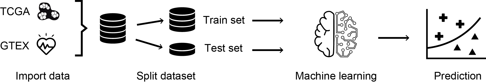
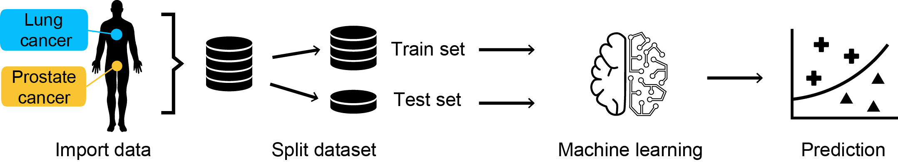

<script>
   $(document).ready(function() {
     $head = $('#header');
     $head.prepend('')
   });
</script>

```{r setup, include=FALSE}
knitr::opts_chunk$set(echo = TRUE)
```

# Introduction

This document is an addendum to the review "Artificial intelligence in bulk and single-cell RNA-sequencing data to foster precision oncology" (International Journal of Molecular Sciences, 2021).
In this tutorial we will provide a toy example of how RNA-seq data can be analyzed through Machine Learning techniques to perform sample classification and gene signature extraction. In particular, we will use published RNA-seq data of samples belonging to two cancer types (i.e. prostate and lung) and normal samples belonging to the same tissue types to train and test Random Forest and Support Vector Machine (SVM) classifiers. The aim of this tutorial is to present a pedagogical analysis workflow that includes some of the ML concepts discussed in the manuscript.
The presented analysis is based on the R "caret" package and it was performed on R version 4.0.4.

# Load and filter data

We will first load tumor and normal RNA-seq data of prostate and lung tissues. Tumor samples belong to The Cancer Genome Atlas (TCGA) project, while normal samples belong to the Genotype-Tissue Expression (GTEx) project.
As discussed in the review, the first source of heterogeneity that must be taken into account developing a ML analysis on transcriptomic data is the one originated by technical factors. In our case, the major source of technical heterogeneity would be given by the fact that samples belong to two distinct projects that used different analysis pipelines. The use of batch-correction techniques would be needed to allow a joint analysis of samples of the two datasets. However, the data that we will use for our analysis have already been subjected to batch-correction to make the datasets comparable. These data were produced by Wang et al. (Scientific Data, 2018, https://doi.org/10.1038/sdata.2018.61) and downloaded from https://github.com/mskcc/RNAseqDB . Gene expression values from these datasets, normalized in Fragments Per Kilobase Million (FPKM), will be used as features by the ML models.


```{r DATA, include=FALSE}
#load required libraries
library(caret)
library(randomForest)
library(gridExtra)
library(e1071)
library(kernlab)
library(Rtsne)

#load datasets
normal_A=read.table('~/Downloads/Notebook_AI/raw_data/prostate-rsem-fpkm-gtex.txt.gz',header = T) #prostate tissue
normal_B=read.table('~/Downloads/Notebook_AI/raw_data/lung-rsem-fpkm-gtex.txt.gz',header = T) #lung tissue


tumor_A=read.table('~/Downloads/Notebook_AI/raw_data/prad-rsem-fpkm-tcga-t.txt.gz',header = T) #prostate adenocarcinoma
tumor_B=read.table('~/Downloads/Notebook_AI/raw_data/luad-rsem-fpkm-tcga-t.txt.gz',header = T) #lung adenocarcinoma 

```

```{r DATArel_path, eval=FALSE, include=TRUE}
#load required libraries
library(caret)
library(randomForest)
library(gridExtra)
library(e1071)
library(kernlab)
library(Rtsne)

#load datasets
normal_A=read.table('sources/prostate-rsem-fpkm-gtex.txt.gz',header = T) #prostate tissue
normal_B=read.table('sources/lung-rsem-fpkm-gtex.txt.gz',header = T) #lung tissue


tumor_A=read.table('sources/prad-rsem-fpkm-tcga-t.txt.gz',header = T) #prostate adenocarcinoma
tumor_B=read.table('sources/luad-rsem-fpkm-tcga-t.txt.gz',header = T) #lung adenocarcinoma 

```


Note that the first two columns of each dataset contain gene-related annotations (Hugo and ENTREZ format).
```{r, head_data}
tumor_A[1:5, 1:4]
```

## Load gene set of interest
To reduce the number of possible features, we restrict our analysis to a known set of cancer-associated genes. We will use cancer genes annotated in NCG6 (Network of Cancer Genes 6) which is a comprehensive catalogue of experimentally-validated cancer genes by Repana et al. Genome Biology, 2019 (https://doi.org/10.1186/s13059-018-1612-0).

```{r, cancer_genes, include=FALSE}
cancer_genes = read.delim('~/Downloads/Notebook_AI/NCG6_tsgoncogene.tsv',header = T,sep='\t')
```

```{r, cancer_genes_rel_path, eval=FALSE, include=TRUE}
cancer_genes = read.delim('sources/NCG6_tsgoncogene.tsv',header = T,sep='\t')
```

Tumor and Normal datasets are filtered on the set of cancer genes.

```{r filtergenes, echo=TRUE, results='hide'}
# Tumor : ---
tumor_A=subset(tumor_A,Entrez_Gene_Id%in%cancer_genes$entrez)
rep=names(table(tumor_A$Entrez_Gene_Id)[which(table(tumor_A$Entrez_Gene_Id)>1)])
tumor_A=subset(tumor_A,!Entrez_Gene_Id%in%rep | Hugo_Symbol%in%subset(cancer_genes,entrez%in%rep)$symbol)
rownames(tumor_A)=tumor_A$Entrez_Gene_Id

tumor_B=subset(tumor_B,Entrez_Gene_Id%in%cancer_genes$entrez)
rep=names(table(tumor_B$Entrez_Gene_Id)[which(table(tumor_B$Entrez_Gene_Id)>1)])
tumor_B=subset(tumor_B,!Entrez_Gene_Id%in%rep | Hugo_Symbol%in%subset(cancer_genes,entrez%in%rep)$symbol)
rownames(tumor_B)=tumor_B$Entrez_Gene_Id

# Normal : ---
normal_A=subset(normal_A,Entrez_Gene_Id%in%cancer_genes$entrez)
rep=names(table(normal_A$Entrez_Gene_Id)[which(table(normal_A$Entrez_Gene_Id)>1)])
normal_A=subset(normal_A,!Entrez_Gene_Id%in%rep | Hugo_Symbol%in%subset(cancer_genes,entrez%in%rep)$symbol)
rownames(normal_A)=normal_A$Entrez_Gene_Id

normal_B=subset(normal_B,Entrez_Gene_Id%in%cancer_genes$entrez)
rep=names(table(normal_B$Entrez_Gene_Id)[which(table(normal_B$Entrez_Gene_Id)>1)])
normal_B=subset(normal_B,!Entrez_Gene_Id%in%rep | Hugo_Symbol%in%subset(cancer_genes,entrez%in%rep)$symbol)
rownames(normal_B)=normal_B$Entrez_Gene_Id
```

## Separate training and test set

We randomly split each dataset in a **training** and a **test set**. The first one will be used by the model in the learning process to tune its parameters and achieve an optimal classification based on known labels (i.e. Tumor-Normal or PRAD-LUAD). The second one, containing samples that the model has not seen before, will be used to assess the performance of the trained model. The training set will contain 75% of samples, while the test set will contain the remaining 25%. 

```{r, split_data}
set.seed(900808)

tumor_A_train = tumor_A[,c("Hugo_Symbol","Entrez_Gene_Id", 
                           sample(x = colnames(tumor_A)[3:ncol(tumor_A)],
                                  size = round((ncol(tumor_A)-2)*0.75), 
                                  replace = F))]
tumor_A_test = cbind(tumor_A[,1:2],tumor_A[,!colnames(tumor_A)%in%colnames(tumor_A_train)])

tumor_B_train = tumor_B[,c("Hugo_Symbol","Entrez_Gene_Id",
                           sample(x = colnames(tumor_B)[3:ncol(tumor_B)],
                                  size = round((ncol(tumor_B)-2)*0.75),
                                  replace = F))]
tumor_B_test = cbind(tumor_B[,1:2],tumor_B[,!colnames(tumor_B)%in%colnames(tumor_B_train)])

normal_A_train = normal_A[,c("Hugo_Symbol","Entrez_Gene_Id",
                             sample(x = colnames(normal_A)[3:ncol(normal_A)],
                                    size = round((ncol(normal_A)-2)*0.75),
                                    replace = F))]
normal_A_test = cbind(normal_A[,1:2],normal_A[,!colnames(normal_A)%in%colnames(normal_A_train)])

normal_B_train = normal_B[,c("Hugo_Symbol","Entrez_Gene_Id",
                             sample(x = colnames(normal_B)[3:ncol(normal_B)],
                                   size = round((ncol(normal_B)-2)*0.75),
                                   replace = F))]
normal_B_test = cbind(normal_B[,1:2],normal_B[,!colnames(normal_B)%in%colnames(normal_B_train)])
```


# Tumor-Normal Classification





The aim of this section is to train ML models capable of discriminating tumor samples (prostate and lung adenocarcinoma) from samples of normal prostate and lung tissues. We will train a Random Forest and an SVM classifier, compare them on training samples and evaluate their performance on the test set. Finally, for each model, we will extract a putative signature of cancer genes whose expression most likely discriminates between tumor and normal samples.  


## Create full training set matrix

We create the full training set matrix, including tumor and normal samples of both prostate and lung, that will be used in the learning process.

```{r full_train_dataset, echo=TRUE, results='hide'}
# Tumor : ---
tumor_A_train=subset(tumor_A_train, Entrez_Gene_Id%in%tumor_B_train$Entrez_Gene_Id)
tumor_B_train=subset(tumor_B_train, Entrez_Gene_Id%in%tumor_A_train$Entrez_Gene_Id)

tumor_train_set = as.data.frame(t(cbind(tumor_A_train[,3:ncol(tumor_A_train)],tumor_B_train[,3:ncol(tumor_B_train)])))

# Normal : ---
normal_A_train=subset(normal_A_train, Entrez_Gene_Id%in%normal_B_train$Entrez_Gene_Id)
normal_B_train=subset(normal_B_train, Entrez_Gene_Id%in%normal_A_train$Entrez_Gene_Id)

normal_train_set = as.data.frame(t(cbind(normal_A_train[,3:ncol(normal_A_train)],normal_B_train[,3:ncol(normal_B_train)])))

# Merge : ---

ncol(tumor_train_set) == ncol(normal_train_set)
sum(colnames(tumor_train_set)==colnames(normal_train_set))/ncol(normal_train_set)

train_set = rbind(tumor_train_set,normal_train_set)

colnames(train_set)=paste0('g_',colnames(train_set)[1:(ncol(train_set))])

train_set$type=factor(c(rep('Tumor',nrow(tumor_train_set)),rep('Normal',nrow(normal_train_set))),levels=c('Normal','Tumor'))

```

## Create full test set matrix

We create the full test set matrix, including tumor and normal samples of both prostate and lung, that will be used for the evaluation of the model performance on unseen data.

```{r full_test_dataset, echo=TRUE, results='hide'}
# Tumor : ---
tumor_A_test=subset(tumor_A_test, Entrez_Gene_Id%in%tumor_B_test$Entrez_Gene_Id)
tumor_B_test=subset(tumor_B_test, Entrez_Gene_Id%in%tumor_A_test$Entrez_Gene_Id)

tumor_test_set = as.data.frame(t(cbind(tumor_A_test[,3:ncol(tumor_A_test)],tumor_B_test[,3:ncol(tumor_B_test)])))

# Normal : ---
normal_A_test=subset(normal_A_test, Entrez_Gene_Id%in%normal_B_test$Entrez_Gene_Id)
normal_B_test=subset(normal_B_test, Entrez_Gene_Id%in%normal_A_test$Entrez_Gene_Id)

normal_test_set = as.data.frame(t(cbind(normal_A_test[,3:ncol(normal_A_test)],normal_B_test[,3:ncol(normal_B_test)])))

# Merge : ---

ncol(tumor_test_set) == ncol(normal_test_set)
sum(colnames(tumor_test_set)==colnames(normal_test_set))/ncol(normal_test_set)

test_set = rbind(tumor_test_set,normal_test_set)

colnames(test_set)=paste0('g_',colnames(test_set)[1:(ncol(test_set))])

test_set$type=factor(c(rep('Tumor',nrow(tumor_test_set)),rep('Normal',nrow(normal_test_set))),levels=c('Normal','Tumor'))
```

## Data preprocessing

As discussed in the manuscript, feature centering and scaling is a critical preprocessing step to assure that all variables proportionally contribute to the AI model. We then use the preProcess function of the "caret" package to jointly center and scale the training and test sets.

```{r scale_data}
tmp = rbind(train_set,test_set)

all_data = tmp[,1:(ncol(tmp)-1)]

all_data = predict(preProcess(all_data,method = c("center", "scale", "YeoJohnson", "nzv")),all_data) 
all_data$type=tmp$type

train_set = all_data[1:nrow(train_set),]
test_set = all_data[(nrow(train_set)+1):(nrow(train_set)+nrow(test_set)),]

```

## Explore dataset

Before moving to the learning step, we can visualise the entire dataset composed of training and test set using a dimensionality reduction method. We here propose the use of the t-distributed stochastic neighbor embedding (tSNE), but other techniques, such as PCA and UMAP, could be used as well. Given tSNE inherent stochasticity, a seed needs to be set to ensure the reproducibility of the visualisation.

### tSNE

```{r tsne, message=FALSE, results=FALSE}
set.seed(94512)   
tsne <- Rtsne(all_data[,colnames(all_data)!='type'], dims = 2, perplexity=15, verbose=TRUE, max_iter = 500)

tsne.df = as.data.frame(tsne$Y)
rownames(tsne.df) = rownames(all_data)
colnames(tsne.df) = c('tsne.1', 'tsne.2')

tsne.df$type = all_data$type

ggplot(tsne.df, aes(x=tsne.1, y=tsne.2, color=type))+
  geom_point()+
  theme_bw()

```

Besides the separation between tumor and normal samples, tSNE representation clearly shows the presence of two distinct groups of samples that correspond to the two tissue types.


# **Tumor-Normal Models**

## **Random Forest**: Train model

We will now define and train a Random Forest for tumor-normal classification.
Firstly, we specify the formula containing the relation between features (genes' expression) and sample type (tumor or normal).

```{r}
sel=colnames(train_set[1:(ncol(train_set)-1)]) 

formula <- as.formula(paste("type ~ ",
                             paste(sel, collapse = "+")))

to_forest = train_set
```

Secondly, we define the resampling method to be used during the training of the model. In this case we use 10-fold cross-validation (cv).

```{r}
train_control <- trainControl(method="cv", number=10, classProbs = TRUE, summaryFunction = twoClassSummary)
```

The training set is finally fed to the Random Forest model (rf) and the learning step is performed.
Attention! The following module could take several minutes to train model. Feel free to skip this module if you want and directly load the pre-trained model from the subsequent module.

```{r eval=FALSE, include=TRUE}
set.seed(900808)
Sys.time()
rf2 <- train(formula, data = to_forest, method = "rf", tuneLength=10, importance=T, trControl=train_control, metric = "ROC")
Sys.time()
```

The pre-trained model can be loaded from the Rdata folder. 

```{r rf_TN, include=FALSE}
load('~/Downloads/Notebook_AI/Rdata/trained_models_on_cancer_genes.Rdata')
rf2 = rf_TN
```

```{r eval=FALSE, include=TRUE}
load('Rdata/trained_models_on_cancer_genes.Rdata')
rf2 = rf_TN
```

The resulting trained model is:

```{r}
rf2 
```

We can test the performance of the model on the training data comparing the predicted sample types with the true ones. Both the metrics used to evaluate the performance show a perfect classification capability.

```{r}
postResample(predict(rf2,newdata = to_forest),to_forest$type)
```

## **SVM**: Train model

Following the same steps described for the Random Forest we now train a SVM for the same classification task.

```{r}
sel=colnames(train_set[1:(ncol(train_set)-1)]) 

formula <- as.formula(paste("type ~ ",
                            paste(sel, collapse = "+")))

to_svm = train_set

# 10-fold cross-validation ("cv") is used as resampling method to train the model

train_control <- trainControl(method="cv", number=10, classProbs = TRUE, summaryFunction = twoClassSummary)
```


```{r eval=FALSE, include=TRUE}
set.seed(900808)
Sys.time()
svm <- train(formula, data = to_svm, method = "svmRadial", tuneLength=10, importance=T, trControl=train_control, metric = "ROC")
Sys.time()
```

The pre-trained model can be loaded from the Rdata folder. 

```{r,include=FALSE}
load('~/Downloads/Notebook_AI/Rdata/trained_models_on_cancer_genes.Rdata')
svm = svm_TN
```

```{r,eval=FALSE, include=TRUE, results='hide'}
load('Rdata/trained_models_on_cancer_genes.Rdata')
svm = svm_TN
```

Show the trained model and evaluate its performance on the training set.

```{r}
svm

```

The SVM achieves a perfect classification of samples in the training set.

```{r}
postResample(predict(svm,newdata = to_svm),to_svm$type)
```

## Compare models

Both models perform extremely well on the training set. However, to test whether one model performs significantly better than the other, a comparison based on three metrics (Sensitivity, Specificity and ROC) can be applied.

```{r}
model_list <- list(SVM = svm, RF = rf2)
res <- resamples(model_list)
summary(res)

p1=bwplot(res)
p2=dotplot(res)
grid.arrange(p1,p2)


difValues <- diff(res)
difValues
summary(difValues)
```

Confirming what can be observed in the plots above, this result indicates a significantly higher Sensitivity in the SVM model with respect to Random Forest.
Finally, the difference of the three metrics between the two models can be visualised.

```{r}
bwplot(difValues, layout = c(3, 1))
```

The trained models are stored in new variables.

```{r}
svm_TN = svm  #store trained models in new variables
rf_TN = rf2

```


## **Random Forest**: Test model 

We can now test the classification performance of the trained Random Forest on the test set, which contains samples not used for training. Again, we compare predicted sample types with the true ones. The confusionMatrix function returns a more complete summary of the comparison, explicitly indicating the number of correctly classified or misclassified samples.

```{r}
prediction = predict(rf2,newdata = test_set)

postResample(prediction,test_set$type)

confusionMatrix(prediction,test_set$type)
```

The above results indicate that only six samples of the test set were misclassified by the Random Forest. The following plots show the tSNE representation of the entire dataset, with samples belonging to the training set shown in grey and samples of the test set colored either based on the true labels (left) or on the predicted ones (right). The black cross indicates the position of the misclassified sample.

```{r fig.height = 3, fig.width = 8}

p1=ggplot()+
  geom_point(data = tsne.df, mapping = aes(x=tsne.1, y=tsne.2), color='gray')+
  geom_point(data=tsne.df[rownames(test_set),],mapping =  aes(x=tsne.1, y=tsne.2, color=test_set$type))+
  ggtitle(label = 'True labels')+
  theme_bw()

tsne_test=tsne.df[rownames(test_set),]
tsne_test$prediction <- prediction

p2=ggplot()+
  geom_point(data = tsne.df, mapping = aes(x=tsne.1, y=tsne.2), color='gray')+
  geom_point(data = tsne_test, mapping = aes(x=tsne.1, y=tsne.2, color=prediction))+ 
  geom_point(data= subset(tsne_test, prediction!=type), mapping = aes(x=tsne.1, y=tsne.2), shape = 4, color='black', size=2, stroke=2)+
  ggtitle(label = 'Predicted labels')+
  theme_bw()

grid.arrange(p1,p2, ncol=2)


```


## **SVM**: Test model

As done for the Random Forest we now test the classification performance of the SVM on the test set.

```{r}
# Test the accuracy of the final model on the test set
prediction = predict(svm,newdata = test_set)
postResample(prediction,test_set$type)

confusionMatrix(prediction,test_set$type)
```

This model achieves a perfect classification of samples in the test set, as shown by the above results and plots below.

```{r fig.height = 3, fig.width = 8}

p1=ggplot()+
  geom_point(data = tsne.df, mapping = aes(x=tsne.1, y=tsne.2), color='gray')+
  geom_point(data=tsne.df[rownames(test_set),],mapping =  aes(x=tsne.1, y=tsne.2, color=test_set$type))+
  ggtitle(label = 'True labels')+
  theme_bw()

tsne_test=tsne.df[rownames(test_set),]
tsne_test$prediction <- prediction

p2=ggplot()+
  geom_point(data = tsne.df, mapping = aes(x=tsne.1, y=tsne.2), color='gray')+
  geom_point(data = tsne_test, mapping = aes(x=tsne.1, y=tsne.2, color=prediction))+ 
  geom_point(data= subset(tsne_test, prediction!=type), mapping = aes(x=tsne.1, y=tsne.2), shape = 4, color='black', size=4)+
  ggtitle(label = 'Predicted labels')+
  theme_bw()

grid.arrange(p1,p2, ncol=2)


```


## Compare important features

Finally, once shown the high classification capability of both models on unseed data, we extract the features (genes) that have the highest importance for classification. For each model we select the top 20 genes based on importance metrics. These gene sets constitute putative signatures of genes involved in discriminating tumor and normal samples.

# Random Forest most important features

```{r}
roc_imp_rf <- varImp(rf2, scale = FALSE)
rownames(roc_imp_rf$importance)=sapply(strsplit(rownames(roc_imp_rf$importance),'_'),`[`,2)
rownames(roc_imp_rf$importance)=cancer_genes$symbol[match(rownames(roc_imp_rf$importance),cancer_genes$entrez)]
top_20_rf_TN = rownames(roc_imp_rf$importance[order(roc_imp_rf$importance$Normal,decreasing = T),])[1:20]
plot(roc_imp_rf, top=20)
```

# SVM most important features

```{r}
roc_imp_svm <- varImp(svm, scale = FALSE)
rownames(roc_imp_svm$importance)=sapply(strsplit(rownames(roc_imp_svm$importance),'_'),`[`,2)
rownames(roc_imp_svm$importance)=cancer_genes$symbol[match(rownames(roc_imp_svm$importance),cancer_genes$entrez)]
top_20_svm_TN = rownames(roc_imp_svm$importance[order(roc_imp_svm$importance$Normal,decreasing = T),])[1:20]
plot(roc_imp_svm, top=20)
```

Ten genes are identified among the top 20 important features by both models. In a real research setting, these consensus genes would likely be prioritized for further investigation.

```{r}
top_20_rf_TN[top_20_rf_TN%in%top_20_svm_TN] 

```


# PRAD-LUAD Classification





In this section we will use Random Forest and SVM models to classify samples of two tumor types: prostate and lung adenocarcinoma (PRAD and LUAD, respectively). We will follow the same steps described in the previous section. It is worth noting that, given the strong molecular differences between prostate and lung tissue, this classification task is expected to be easy for the models.

## Create full training set matrix

We create the full training set matrix, including PRAD and LUAD samples, that will be used in the learning process.

```{r full_train_dataset2, echo=TRUE, results='hide'}
# Tumor : ---
train_set = tumor_train_set

colnames(train_set)=paste0('g_',colnames(train_set)[1:(ncol(train_set))])

train_set$type=factor(c(rep('PRAD',(ncol(tumor_A_train)-2)),rep('LUAD',(ncol(tumor_B_train)-2))),levels=c('PRAD','LUAD'))

```

## Create full test set matrix

We create the full test set matrix, including PRAD and LUAD samples, that will be used for the evaluation of the model performance on unseen data.

```{r full_test_dataset2, echo=TRUE, results='hide'}
# Tumor : ---
test_set = tumor_test_set

colnames(test_set)=paste0('g_',colnames(test_set)[1:(ncol(test_set))])

test_set$type=factor(c(rep('PRAD',(ncol(tumor_A_test)-2)),rep('LUAD',(ncol(tumor_B_test)-2))),levels=c('PRAD','LUAD'))

```

## Data preprocessing

We use the preProcess function of the "caret" package to jointly center and scale the training and test sets.

```{r scale_data2}
tmp = rbind(train_set,test_set)

all_data = tmp[,1:(ncol(tmp)-1)]

all_data = predict(preProcess(all_data,method = c("center", "scale", "YeoJohnson", "nzv")),all_data) 
all_data$type=tmp$type

train_set = all_data[1:nrow(train_set),]
test_set = all_data[(nrow(train_set)+1):(nrow(train_set)+nrow(test_set)),]
```

## Explore dataset

Before going into the learning step, we can visualise the entire dataset, composed of training and test set, using the dimensionality reduction method tSNE. Given tSNE inherent stochasticity, a seed needs to be set to ensure the reproducibility of the visualisation.

### tSNE

```{r tsne2, message=FALSE, results=FALSE}
set.seed(900808) 
tsne <- Rtsne(all_data[,colnames(all_data)!='type'], dims = 2, perplexity=15, verbose=TRUE, max_iter = 500)

tsne.df = as.data.frame(tsne$Y)
rownames(tsne.df) = rownames(all_data)
colnames(tsne.df) = c('tsne.1', 'tsne.2')

tsne.df$type = all_data$type

ggplot(tsne.df, aes(x=tsne.1, y=tsne.2, color=type))+
  geom_point()+
  theme_bw()

```

tSNE representation clearly shows the presence of two distinct sample clusters, corresponding to PRAD and LUAD samples.


# **Tumor-Tumor Models**
## **Random Forest**: Train model

We define and train a Random Forest for PRAD-LUAD classification.
Firstly, we specify the formula containing the relation between features (genes' expression) and sample type (PRAD or LUAD).

```{r}
sel=colnames(train_set[1:(ncol(train_set)-1)]) 

formula <- as.formula(paste("type ~ ",
                            paste(sel, collapse = "+")))

to_forest = train_set

```

Secondly, we define the resampling method to be used during the training of the model. In this case we use 10-fold cross-validation (cv).

```{r}
train_control <- trainControl(method="cv", number=10, classProbs = TRUE, summaryFunction = twoClassSummary)
```

The training set is finally fed to the Random Forest model (rf) and the learning step is performed.
Attention! The following module could take several minutes to train model. Feel free to skip this module if you want and directly load the pre-trained model from the subsequent module.

```{r eval=FALSE, include=TRUE}
set.seed(900808)
Sys.time()
rf2 <- train(formula, data = to_forest, method = "rf", tuneLength=10, importance=T, trControl=train_control, metric = "ROC")
Sys.time()
```

The pre-trained model can be loaded from the Rdata folder. 

```{r,include=FALSE}
load('~/Downloads/Notebook_AI/Rdata/trained_models_on_cancer_genes.Rdata')
rf2 = rf_TT
```

```{r,eval=FALSE, include=TRUE}
load('Rdata/trained_models_on_cancer_genes.Rdata')
rf2 = rf_TT
```

The resulting trained model is:

```{r}
rf2

```

We can test the performance of the model on the training data comparing the predicted sample types with the true ones. Both the metrics used to evaluate the performance indicate a perfect classification on the training set.

```{r}
postResample(predict(rf2,newdata = to_forest),to_forest$type)
```

## **SVM**: Train model

Following the same steps described for the Random Forest we train a SVM for the same classification task.

```{r}
sel=colnames(train_set[1:(ncol(train_set)-1)]) # If you want to speed up the analysis select a smaller subset of these genes.

formula <- as.formula(paste("type ~ ",
                            paste(sel, collapse = "+")))

to_svm = train_set

# 10-fold cross-validation ("cv") is used as resampling method to train the model

train_control <- trainControl(method="cv", number=10, classProbs = TRUE, summaryFunction = twoClassSummary)
```


```{r eval=FALSE, include=TRUE}
set.seed(900808)
Sys.time()
svm <- train(formula, data = to_svm, method = "svmRadial", tuneLength=10, importance=T, trControl=train_control, metric = "ROC")
Sys.time()
```


```{r, include=FALSE}
load('~/Downloads/Notebook_AI/Rdata/trained_models_on_cancer_genes.Rdata')
svm = svm_TT
```

```{r, eval=FALSE, include=TRUE}
load('Rdata/trained_models_on_cancer_genes.Rdata')
svm = svm_TT
```

Show the trained model and evaluate its performance on the training set.

```{r}
svm 

# Test the accuracy of the final model on the training set
postResample(predict(svm, newdata = to_svm), to_svm$type)
```

Also the SVM achieves a perfect classification of the training set.

## Compare models 

As shown above, both models achieve a perfect classification of the training set. The comparison below confirms this point, showing no differences of the evaluation metrics between the two models.

```{r}
model_list <- list(SVM = svm, RF = rf2)
res <- resamples(model_list)
summary(res)

p1=bwplot(res)
p2=dotplot(res)
grid.arrange(p1,p2)


difValues <- diff(res)
difValues
summary(difValues)

bwplot(difValues, layout = c(3, 1))

svm_TT = svm
rf_TT = rf2

```


## **Random Forest**: Test model 

We can now test the classification performance of the trained Random Forest on the test set, which contains samples not used for training. Again, we compare predicted sample types with the true ones. The confusionMatrix function returns a more complete summary of the comparison, explicitly indicating the number of correctly classified or misclassified samples.

```{r}
# Test the accuracy of the final model on the test set

prediction = predict(rf2,newdata = test_set)

postResample(prediction,test_set$type)

confusionMatrix(prediction, test_set$type)
```

The Random Forest achieves a perfect classification also of the test set, with no misclassified samples.

```{r  fig.height = 3, fig.width = 8}

p1=ggplot()+
  geom_point(data = tsne.df, mapping = aes(x=tsne.1, y=tsne.2), color='gray')+
  geom_point(data=tsne.df[rownames(test_set),],mapping =  aes(x=tsne.1, y=tsne.2, color=test_set$type))+
  ggtitle(label = 'True labels')+
  theme_bw()

tsne_test=tsne.df[rownames(test_set),]
tsne_test$prediction <- prediction

p2=ggplot()+
  geom_point(data = tsne.df, mapping = aes(x=tsne.1, y=tsne.2), color='gray')+
  geom_point(data = tsne_test, mapping = aes(x=tsne.1, y=tsne.2, color=prediction))+ 
  geom_point(data= subset(tsne_test, prediction!=type), mapping = aes(x=tsne.1, y=tsne.2), shape = 4, color='black', size=4)+
  ggtitle(label = 'Predicted labels')+
  theme_bw()

grid.arrange(p1,p2, ncol=2)


```

## **SVM**: Test model

As done for the Random Forest we now test the classification performance of the SVM on the test set.

```{r}
# Test the accuracy of the final model on the test set

prediction = predict(svm,newdata = test_set)
postResample(prediction,test_set$type)

confusionMatrix(prediction,test_set$type)
```

Also the SVM achieves a perfect classification of the test set.

```{r fig.height = 3, fig.width = 8}

p1=ggplot()+
  geom_point(data = tsne.df, mapping = aes(x=tsne.1, y=tsne.2), color='gray')+
  geom_point(data=tsne.df[rownames(test_set),],mapping =  aes(x=tsne.1, y=tsne.2, color=test_set$type))+
  ggtitle(label = 'True labels')+
  theme_bw()

tsne_test=tsne.df[rownames(test_set),]
tsne_test$prediction <- prediction

p2=ggplot()+
  geom_point(data = tsne.df, mapping = aes(x=tsne.1, y=tsne.2), color='gray')+
  geom_point(data = tsne_test, mapping = aes(x=tsne.1, y=tsne.2, color=prediction))+ 
  geom_point(data= subset(tsne_test, prediction!=type), mapping = aes(x=tsne.1, y=tsne.2), shape = 4, color='black', size=4)+
  ggtitle(label = 'Predicted labels')+
  theme_bw()

grid.arrange(p1,p2, ncol=2)


```


## Compare important features 

Finally, we can extract the features (genes) that have the highest importance for classification. These gene sets constitute putative signatures of genes involved in discriminating the two tumor types.

# Random Forest most important features

```{r}
roc_imp_rf <- varImp(rf2, scale = FALSE)
rownames(roc_imp_rf$importance)=sapply(strsplit(rownames(roc_imp_rf$importance),'_'),`[`,2)
rownames(roc_imp_rf$importance)=cancer_genes$symbol[match(rownames(roc_imp_rf$importance),cancer_genes$entrez)]
top_20_rf_TT = rownames(roc_imp_rf$importance[order(roc_imp_rf$importance$PRAD,decreasing = T),])[1:20]
plot(roc_imp_rf, top=20)
```

# SVM most important features

Based on the ROC metric, that measures feature importance for the SVM model, 108 genes have the same importance=1. The plot below shows a random subset of 20 of these genes.

```{r}
roc_imp_svm <- varImp(svm, scale = FALSE)
rownames(roc_imp_svm$importance)=sapply(strsplit(rownames(roc_imp_svm$importance),'_'),`[`,2)
rownames(roc_imp_svm$importance)=cancer_genes$symbol[match(rownames(roc_imp_svm$importance),cancer_genes$entrez)]
top_20_svm_TT = rownames(roc_imp_svm$importance[order(roc_imp_svm$importance$PRAD,decreasing = T),])[1:sum(roc_imp_svm$importance$PRAD==1)]
plot(roc_imp_svm, top=20)
```

We finally intersect the top 20 important genes of the Random Forest, with the 108 genes with importance=1 in the SVM. 13 genes are identified in both models, suggesting their role in discriminating PRAD and LUAD samples.

```{r}
top_20_rf_TT[top_20_rf_TT%in%top_20_svm_TT]
```

### Save trained models
```{r eval=FALSE,include=TRUE }
# save(rf_TT,rf_TN,svm_TT,svm_TN,file = 'Rdata/trained_models_on_cancer_genes.Rdata')
```

